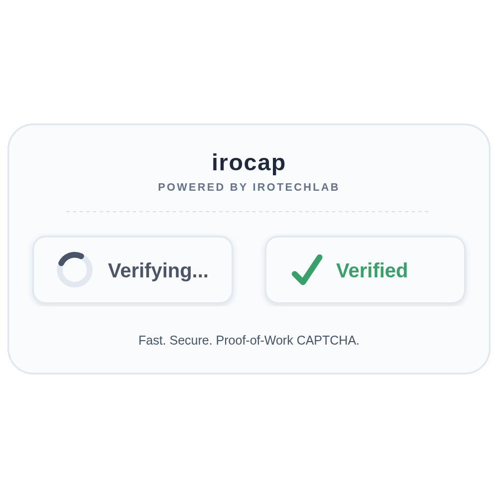
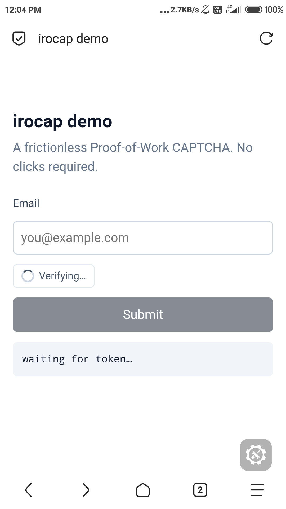
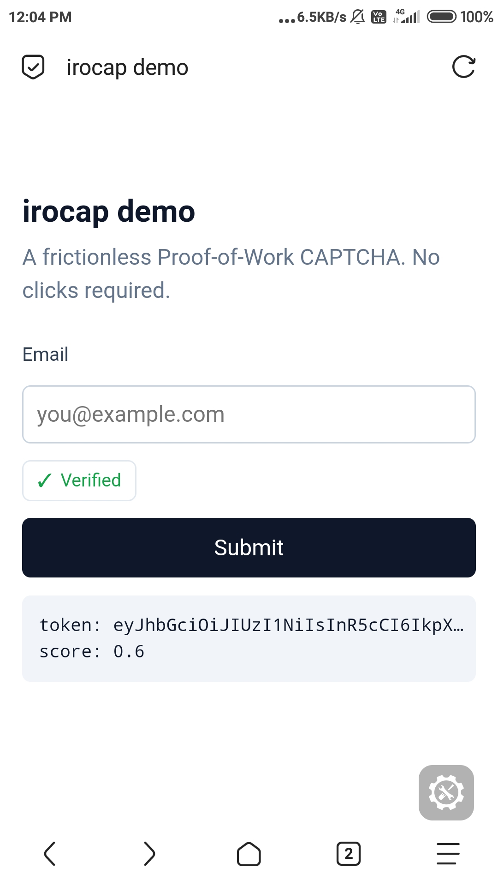

# irocap

A privacy-first Proof-of-Work CAPTCHA.

- No image puzzles.
- No user interaction.
- No cookies, no third-party scripts, no tracking.
- Runs on Vercel serverless functions + NeonDB (both free-tier friendly).

Visitors silently solve a SHA-256 hash puzzle in a Web Worker. Suspicious
traffic is scored and challenged harder.



---

## Table of contents

- [How it works](#how-it-works)
- [Features](#features)
- [Anti-automation layers](#anti-automation-layers)
- [Quick start](#quick-start)
- [Deploy to Vercel](#deploy-to-vercel)
- [Admin panel](#admin-panel)
- [Integration](#integration)
- [Configuration reference](#configuration-reference)
- [Architecture](#architecture)
- [Performance](#performance)
- [Security notes](#security-notes)
- [Limitations](#limitations)
- [License](#license)

---

## How it works

1. The widget asks `POST /api/challenge` for a random 48-character
   hex challenge plus a difficulty (default 5 = 5 leading zero hex chars).

2. A Web Worker builds itself from an inline Blob URL and solves the puzzle:
   it brute-forces a nonce until `SHA256(challenge + nonce)`
   starts with N zeros.

3. The widget collects behavioral, browser, and environment signals and
   posts everything to `/api/verify`. The server re-checks the
   hash, marks the challenge solved atomically (replay protection), runs
   five independent scoring layers, and signs a 5-minute HS256 JWT.

4. The widget injects
   `<input type="hidden" name="irocap-token">` into the
   nearest form and fires `callback(token, score)`.

5. Your backend calls `POST /api/siteverify` with your secret and
   the token. Single-use is enforced by an atomic
   `UPDATE ... WHERE used=FALSE RETURNING`.

### In action

| Solving | Verified |
| :---: | :---: |
|  |  |

The widget runs silently. The visitor fills the form while the solver
works in the background — no clicks, no puzzles, no interruptions.

---

## Features

- Three-tier solver — Web Worker + WASM, Web Worker + inline JS, then
  `crypto.subtle` on the main thread. Same hash, three paths.
- HMAC-signed challenges — prevents forged or tampered challenges without a
  DB lookup.
- Server-observed trusted signals — UA, Accept-Language,
  `sec-ch-ua`, `sec-fetch-*`, Origin, Referer, timing,
  ASN. Read from the HTTP request itself, not from the client's body.
- Consistency checks — cross-checks headers against client-claimed values.
- Behavioral telemetry — mouse paths, keystroke rhythm, scroll events.
- Environment fingerprinting — probes the JS environment for headless and
  automation markers (Chrome API surface, plugin count, WebGL renderer
  string, window geometry, and more).
- Fingerprint reputation — hash-based identity with per-fingerprint trust.
- IP reputation — per-IP trust scoring across many solves.
- ASN blocking — cloud datacenter IPs capped at score 0.15.
- Single-use tokens — atomic DB enforcement.
- Rate limiting — 60 challenges per minute per IP per sitekey.
- Automatic cleanup — opportunistic + Vercel daily cron + optional external.
- Admin panel — email/password login, site registration, secret rotation,
  live stats. Mobile-friendly.
- No build step — the widget is one file.

---

## Anti-automation layers

Each layer is independent. Removing one does not break the others.

1. **Signed challenges (HMAC)** — forged or tampered challenges are rejected
   without a DB hit. The signature covers challenge + difficulty + issue time.
2. **Server-observed trusted signals** — UA, headers, Origin, Referer, ASN,
   and server-measured timing. These come from the HTTP request itself and
   cannot be spoofed by a plain HTTP client.
3. **Consistency checks** — cross-verifies client-claimed values against
   server-observed ones. Catches UA spoofing, platform mismatches, timezone
   disagreements, and impossible screen geometries.
4. **Environment fingerprinting** — probes the JS environment for headless
   and automation markers. Checks the presence of Chrome-specific APIs,
   plugin/mimetype counts, WebGL renderer strings, window vs screen geometry,
   Permissions API availability, and User-Agent client hints.
5. **Behavioral telemetry** — analyzes the event stream (mouse positions,
   key events, scroll) for scripted motion patterns. Catches linear mouse
   paths, zero-variance velocity, robotic keystroke rhythm, and batched
   event floods.
6. **Fingerprint reputation** — persistent trust per browser fingerprint,
   tracked across solves. Bots that share fingerprints get penalized.
7. **IP reputation** — persistent trust per IP. Repeat offenders face
   higher difficulty.
8. **ASN blocking** — cloud infrastructure is capped at score 0.15.
9. **Atomic single-use tokens** — replay is impossible.
10. **Rate limiting** — 60 challenges/min per IP + sitekey, plus adaptive
    difficulty escalation during bursts.

---

## Quick start

### 1. Clone the repository

```bash
git clone https://github.com/IROTECHLAB/irocap.git
cd irocap
```

### 2. Set up the database

Open https://console.neon.tech, create a project, and copy the **pooled**
connection string (hostname contains `-pooler`).

If it ends with `&channel_binding=require`, remove that
parameter before using it.

Open the Neon SQL Editor and paste the contents of
`scripts/schema.sql`. Click Run.

Verify all 8 tables were created:

```sql
SELECT table_name FROM information_schema.tables
WHERE table_schema = 'public' ORDER BY table_name;
```

Expected: `admin_users`, `challenges`,
`fingerprints`, `ip_asn`, `ip_reputation`,
`irocap_tokens`, `rate_limits`, `sites`.

### 3. Configure environment

Copy `.env.example` to `.env` and fill in the values.
See the Configuration reference for what each variable does.

Generate secrets with:

```bash
node -e "console.log(require('crypto').randomBytes(48).toString('hex'))"
```

### 4. Create the first admin user

Generate a password hash and salt:

```bash
node -e "
  const { randomBytes, scryptSync } = require('node:crypto');
  const pw = process.argv[1];
  const salt = randomBytes(16);
  console.log('hash:', scryptSync(pw, salt, 64).toString('hex'));
  console.log('salt:', salt.toString('hex'));
" 'your-password'
```

In the Neon SQL Editor:

```sql
INSERT INTO admin_users (email, password_hash, password_salt, active)
VALUES (
  'you@example.com',
  '<hash from above>',
  '<salt from above>',
  TRUE
);
```

### 5. Deploy

```bash
vercel --prod
```

Open `/admin.html` to register your first site.

---

## Deploy to Vercel

### 1. Prepare Neon

1. Sign up at https://console.neon.tech
2. Create a project
3. Copy the pooled connection string
4. Paste `scripts/schema.sql` into the SQL Editor and Run

### 2. Prepare Vercel

1. Sign up at https://vercel.com
2. Install the CLI: `npm i -g vercel`
3. Link the project: `vercel link`

### 3. Push environment variables

```bash
vercel env add DATABASE_URL production
vercel env add IROCAP_JWT_SECRET production
vercel env add IROCAP_ADMIN_JWT_SECRET production
vercel env add IROCAP_CHALLENGE_SECRET production
vercel env add CRON_SECRET production
```

Optionally add `IPINFO_TOKEN` for ASN blocking (free tier of
ipinfo.io covers 50,000 lookups/month).

### 4. Deploy

```bash
vercel --prod
```

### 5. Create admin + register site

Insert the admin user via SQL (see Quick start step 4), then open
`/admin.html` and register a site.

### 6. Optional — external cleanup cron

Cleanup runs opportunistically inside `/api/challenge` and
`/api/verify` on about 2% of requests. The Vercel daily cron runs
at 03:00 UTC. For more frequent purging, add an external scheduler:

- **cron-job.org** — URL
  `https://your-deployment.vercel.app/api/cleanup`, method GET,
  header `Authorization: Bearer <CRON_SECRET>`, every 10
  minutes.
- **UptimeRobot** — HTTP monitor on the same URL with the same header.

---

## Admin panel

Access at `/admin.html`.

| Feature | Description |
| --- | --- |
| Sign in | Email + password, scrypt-hashed, 12-hour session JWT |
| Overview | Counters: active sites, 24h challenges, tokens, consumed |
| Register a site | Create a new sitekey + secret pair for a domain |
| Site cards | Sitekey, masked secret, created date, active state |
| Regenerate secret | Rotate the secret; the old one stops working immediately |
| Activate / Deactivate | Toggle whether the site accepts challenges |
| Delete | Remove the site and invalidate its keys |

The secret is write-only. To retrieve a new one, use **Regenerate secret** —
it invalidates the old one and shows the new one exactly once.

---

## Integration

### 1. Add the widget

```html
<script src="https://your-deployment.vercel.app/irocap.js"></script>

<form action="/submit" method="POST">
  <input type="email" name="email" required />
  <div class="irocap"></div>
  <button type="submit">Submit</button>
</form>

<script>
  new Irocap('YOUR_SITEKEY', {
    container: '.irocap'
  });
</script>
```

The widget inserts a hidden `irocap-token` field into the form.

### 2. Verify on your server

```javascript
const r = await fetch('https://your-deployment.vercel.app/api/siteverify', {
  method: 'POST',
  headers: { 'Content-Type': 'application/json' },
  body: JSON.stringify({
    secret: process.env.IROCAP_SECRET,
    response: req.body['irocap-token'],
    remoteip: req.ip
  })
});
const result = await r.json();

if (!result.success || result.score < 0.5) {
  return res.status(400).send('CAPTCHA failed');
}
```

See `INTEGRATION.md` for framework-specific examples (Express,
Next.js, Fastify, Cloudflare Workers, PHP, Python, Go, Ruby, WordPress).

---

## Configuration reference

### Environment variables

| Variable | Required | Purpose |
| --- | --- | --- |
| `DATABASE_URL` | Yes | Neon pooled Postgres URL |
| `IROCAP_JWT_SECRET` | Yes | Signing key for post-solve tokens (5 min TTL) |
| `IROCAP_ADMIN_JWT_SECRET` | Yes | Signing key for admin sessions (12 h TTL) |
| `IROCAP_CHALLENGE_SECRET` | Yes | HMAC key for signing challenges |
| `CRON_SECRET` | Yes | Bearer token protecting `/api/cleanup` |
| `IPINFO_TOKEN` | No | Enables ASN lookup for datacenter blocking |
| `IROCAP_BASE_URL` | No | Public base URL used by scripts |
| `IROCAP_ADMIN_EMAIL` | No | Convenience for CLI scripts |
| `IROCAP_ADMIN_PASSWORD` | No | Convenience for CLI scripts |

### Widget options

| Option | Type | Required | Description |
| --- | --- | --- | --- |
| `sitekey` | string | Yes | Public sitekey from the admin panel |
| `container` | string or Element | Yes | Where the badge renders |
| `callback` | function | No | `(token, score) => void` |
| `error-callback` | function | No | `(err) => void` |
| `base` | string | No | Override the irocap base URL |

### Score thresholds

| Range | Meaning | Suggested action |
| --- | --- | --- |
| 0.8 – 1.0 | Very likely human | Accept |
| 0.5 – 0.8 | Probably human | Accept |
| 0.3 – 0.5 | Mildly suspicious | Accept with rate limit |
| 0.0 – 0.3 | Likely bot | Reject |

Recommended default: `score >= 0.5`.

---

## Architecture

```
irocap/
├── api/                          Vercel serverless functions
│   ├── challenge.ts              Issue signed challenge
│   ├── verify.ts                 Verify PoW + score all layers + issue JWT
│   ├── siteverify.ts             Site-owner verification endpoint
│   ├── cleanup.ts                Cron-protected purge
│   ├── register.ts               Admin: create a site
│   ├── login.ts                  Admin login
│   ├── logout.ts                 Admin logout
│   ├── sites.ts                  Admin: list sites
│   ├── stats.ts                  Admin: dashboard counters
│   └── site-manage.ts            Admin: rotate / toggle / delete
├── lib/
│   ├── db.ts                     Neon HTTP client
│   ├── tokens.ts                 JWT sign/verify
│   ├── admin.ts                  scrypt password + admin session JWT
│   ├── scoring.ts                Client-claimed signal scoring
│   ├── rate-limit.ts             IP+sitekey throttle
│   ├── cleanup.ts                Opportunistic purge
│   ├── challenge-sign.ts         HMAC for challenges
│   ├── trusted.ts                Server-observed signals
│   ├── consistency.ts            Header/client cross-checks
│   ├── behavioral.ts             Event-stream analysis
│   ├── env-signals.ts            Environment / headless detection
│   ├── fingerprint.ts            Fingerprint hashing
│   ├── asn.ts                    ASN lookup + datacenter blocklist
│   └── cors.ts                   CORS preflight helpers
├── public/
│   ├── irocap.js                 Single-file widget
│   ├── index.html                Demo page
│   ├── admin.html                Admin dashboard
│   └── wasm/
│       └── sha256.umd.min.js     Self-hosted hash-wasm UMD
├── scripts/
│   ├── schema.sql                Complete database schema
│   ├── create-admin.ts           Password hash generator
│   ├── register-site.ts          Register a site
│   └── e2e.ts                    End-to-end test
├── vercel.json
└── package.json
```

### Database schema

| Table | Purpose |
| --- | --- |
| `sites` | Registered domains with sitekey + secret |
| `challenges` | Issued challenges (UNLOGGED, ephemeral) |
| `irocap_tokens` | Issued JWTs with single-use flag |
| `rate_limits` | Sliding-window counters per IP + sitekey |
| `admin_users` | Admin accounts (scrypt hash) |
| `fingerprints` | Per-fingerprint reputation |
| `ip_reputation` | Per-IP trust scores |
| `ip_asn` | Cached ASN lookups |

---

## Performance

We do not claim irocap is faster or slower than any other CAPTCHA. Solve
time depends on the visitor's device, browser, and network. You should
benchmark on your own traffic before making any decisions about UX.

**What we can describe accurately:**

- The primary solver runs in a Web Worker. It does not block the main
  thread regardless of how long the solve takes.
- There is no visible timer. The visitor sees a "Verifying…" badge and can
  continue filling out the form.
- A three-tier fallback chain (WASM → inline JS →
  `crypto.subtle`) ensures the solve completes on modern
  browsers, at the cost of speed on older devices.
- Total added latency to a form submission depends on:
  - The visitor's CPU (hash rate)
  - The challenge difficulty (default 5, meaning ~1 million average
    hash attempts)
  - Whether WASM loaded successfully

**What varies:**

- Modern desktops and recent flagships typically solve in well under a
  second.
- Mid-range Android devices typically solve in a few seconds.
- Budget and older Android devices can take tens of seconds. The solve is
  silent — the badge shows "Verifying…" and the visitor can continue
  filling the form.

**If solves feel too slow:**

Lower the base difficulty in `api/challenge.ts`:

```javascript
const BASE_DIFFICULTY = 5;   // change to 4 for faster solves
```

Each step down halves the average solve time and halves the average bot
cost. There is no free lunch.

---

## Security notes

- **Never expose the secret.** Server-side environment variables only.
  Rotate immediately if leaked.
- **Verify on the server.** The widget's callback is a hint. Always call
  `/api/siteverify` from your backend.
- **Enforce a score threshold.** A `success: true` with a low
  score still means a likely bot. Check both.
- **Single-use.** Do not retry verification on failure. A retry burns the
  token.
- **Rate limit your own endpoints.** irocap handles CAPTCHA rate limiting;
  your signup/login endpoints still need their own.
- **Log suspicious activity.** A burst of `already-used` errors
  from one IP is a replay signal.
- **Never put the secret in client-side code.**

---

## Limitations

Honest list of what irocap does **not** stop:

- Real-browser AI agents (Manus, Operator, Claude computer-use). These are
  indistinguishable from real users by design.
- Stealth-patched Puppeteer or Playwright on residential IPs.
- TLS-impersonating proxies (JA3/JA4 spoofing). Vercel abstracts the TLS
  layer, so we cannot inspect the handshake.
- Targeted, patient attackers who mimic human behavior slowly.

This is the same fundamental ceiling every client-side CAPTCHA has.

**What irocap does stop:**

- Plain HTTP clients (curl, requests, axios, Go http, etc.)
- Selenium / Puppeteer with default settings
- Headless Chrome without stealth patches
- Selenium with UA spoofing but no `sec-ch-ua`
- Browsers that claim Chrome but do not expose the Chrome API surface
- Datacenter-hosted bots
- Naive mouse/keyboard scripting
- Replay attacks and cross-site token reuse
- Brute-force flooding

For many sites, that covers the practical threat model.

---

## License

[MIT](LICENSE)